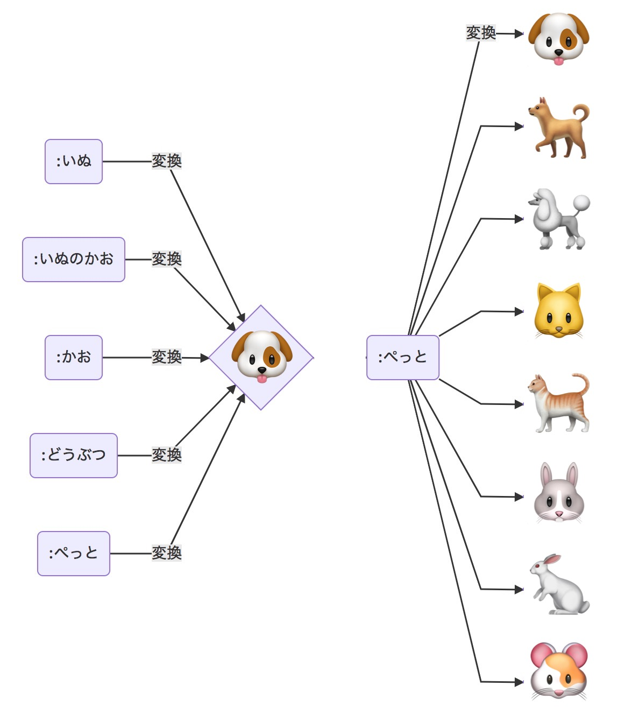
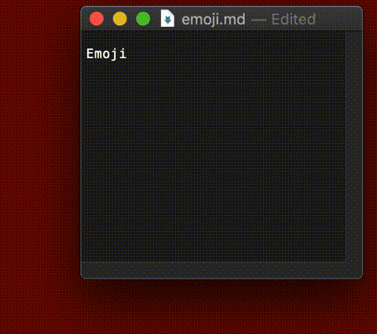
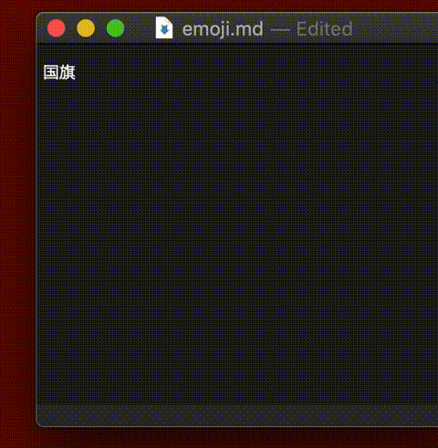

<!-- https://shields.io/ -->
[](https://github.com/peaceiris/emoji-ime-dictionary/blob/master/LICENSE)
[](https://mybinder.org/v2/gh/peaceiris/emoji-ime-dictionary/master?filepath=generate.ipynb)
[](https://colab.research.google.com/github/peaceiris/emoji-ime-dictionary/blob/master/generate.ipynb)

<div align="center">

</div>

<h1 align="center">😃 絵文字入力を日本語 🇯🇵 でするための<br>IME 追加辞書 📙</h1>


## 目次 - Table of Contents

<!-- START doctoc generated TOC please keep comment here to allow auto update -->
<!-- DON'T EDIT THIS SECTION, INSTEAD RE-RUN doctoc TO UPDATE -->


- [概要 - Overview](#%E6%A6%82%E8%A6%81---overview)
- [変換例 - Examples](#%E5%A4%89%E6%8F%9B%E4%BE%8B---examples)
- [辞書の導入方法 - Installation](#%E8%BE%9E%E6%9B%B8%E3%81%AE%E5%B0%8E%E5%85%A5%E6%96%B9%E6%B3%95---installation)
  - [Google 日本語入力](#google-%E6%97%A5%E6%9C%AC%E8%AA%9E%E5%85%A5%E5%8A%9B)
  - [Microsoft IME](#microsoft-ime)
  - [ATOK](#atok)
- [関連プロジェクト - Related project](#%E9%96%A2%E9%80%A3%E3%83%97%E3%83%AD%E3%82%B8%E3%82%A7%E3%82%AF%E3%83%88---related-project)
- [作者 - Author](#%E4%BD%9C%E8%80%85---author)
- [謝辞 - Acknowledgement](#%E8%AC%9D%E8%BE%9E---acknowledgement)
- [ライセンス - License](#%E3%83%A9%E3%82%A4%E3%82%BB%E3%83%B3%E3%82%B9---license)

<!-- END doctoc generated TOC please keep comment here to allow auto update -->


## 概要 - Overview

この辞書を IME に導入することで、
GitHub, Slack のようにコロン `:` をトリガーとして IME でも絵文字を入力することができるようになります。
「**GitHub, Slack 以外のアプリケーションでも GitHub, Slack のように絵文字を入力したい**」
という要望に応えるための IME 追加辞書です。

現在 6610 ペアの絵文字とその読みが収録されています。

| macOS を利用されている方へ |
|:---|
| macOS は `control + command + space` で「文字ビュアー(Character Viewer)」を呼び出すことができるので、この辞書を導入する前にそちらの利用を検討してください。一方で、「**システム言語が英語だけど日本語で絵文字を検索したい**」という方にはこの辞書がおすすめです。 |

- [日本語で絵文字入力するための IME 追加辞書を公開しました - Qiita](https://qiita.com/peaceiris/items/c40ba39679daeb7555c2)


## 変換例 - Examples

- `:にっぽん` を 🇯🇵 に変換することができるようになります。
- 🐶 を入力するには以下の方法があります。
    - `:いぬ`, `:いぬのかお`, `:かお`, `:どうぶつ`, `:ぺっと`
- `:ぺっと` は以下の変換候補を持ちます。
    - 🐇・🐈・🐕・🐩・🐰・🐱・🐶・🐹

[GitHub 上から辞書の中身を閲覧・検索できます。](https://github.com/peaceiris/emoji-ime-dictionary/blob/master/emoji.tsv)

| ぺっと・どうぶつ | こっき |
|---|---|
|  |  |


## 辞書の導入方法 - Installation

- [Releases · peaceiris/emoji-ime-dictionary](https://github.com/peaceiris/emoji-ime-dictionary/releases/latest)

上のリンク先から最新の `emoji.zip` をダウンロード・解凍すると `emoji.txt` が得られるので、
このテキストファイルをお使いの IME にインポートしてください。

### Google 日本語入力

1. `emoji.zip` を解凍して `emoji.txt` を得る
2. Google日本語入力の `辞書ツール` を開く
3. `管理` をクリック
4. `新規辞書にインポート` をクリック
5. `ファイルを選択` から `emoji.txt` を選択
6. お好きな `辞書名` をつける
7. `インポート` をクリック

### Microsoft IME

- [複数の単語を一括で登録するには](https://support.microsoft.com/ja-jp/help/881925)

作者が Windows を持っていないため検証できていません。どなたか検証をお願いします。
[Issue #4](https://github.com/peaceiris/emoji-ime-dictionary/issues/4)

### ATOK

ATOK は元々の機能として「日本語での絵文字入力」が可能ですが、この IME 追加辞書を導入することで表現力を拡張することができます。

cf. [Add: emoji dictionary for ATOK · Issue #15 · peaceiris/emoji-ime-dictionary](https://github.com/peaceiris/emoji-ime-dictionary/issues/15)


## 関連プロジェクト - Related project

- [日英変換・英語略語展開のためのIME追加辞書📙](https://github.com/peaceiris/google-ime-dictionary)


## 作者 - Author

- peaceiris
    - [GitHub](https://github.com/peaceiris)
    - [Twitter](https://twitter.com/piris314)
    - [Amazon wish list](http://amzn.asia/ilWK0Yj)

何かあれば [Issue] を立ててください。Fork & [Pull Requests] もお待ちしてます。

「Qiita いいね :thumbsup:」や「GitHub Star :star:」をいただけると励みになります。


## 謝辞 - Acknowledgement

- [yagays/emoji-ja: UNICODE絵文字の日本語読み/キーワード/分類辞書](https://github.com/yagays/emoji-ja)
    - [project's site](https://yag-ays.github.io/project/emoji-ja/)
- [miurahr/pykakasi](https://github.com/miurahr/pykakasi)


## ライセンス - License

- [MIT License](./LICENSE)
    - `emoji.txt` と `emoji.tsv` は [MIT License - yagays/emoji-ja] を継承しています。


<div align="right">
<a href="#%E7%9B%AE%E6%AC%A1---table-of-contents">目次に戻る☝️</a>
</div>


## Developer notes

```
docker build -t emoji:latest .
docker run --rm -i -t -v ${PWD}:/work emoji:latest
docker run --rm -i -t -v ${PWD}:/work --entrypoint=sh emoji:latest
```


<!-- Internal References -->
[Issue]: https://github.com/peaceiris/emoji-ime-dictionary/issues
[Pull Requests]: https://github.com/peaceiris/emoji-ime-dictionary/pulls
<!-- External References -->
[MIT License - yagays/emoji-ja]: https://github.com/yagays/emoji-ja/blob/master/LICENSE.md
